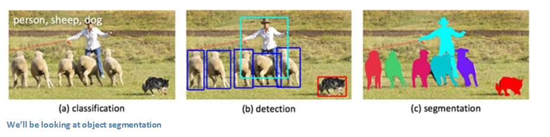
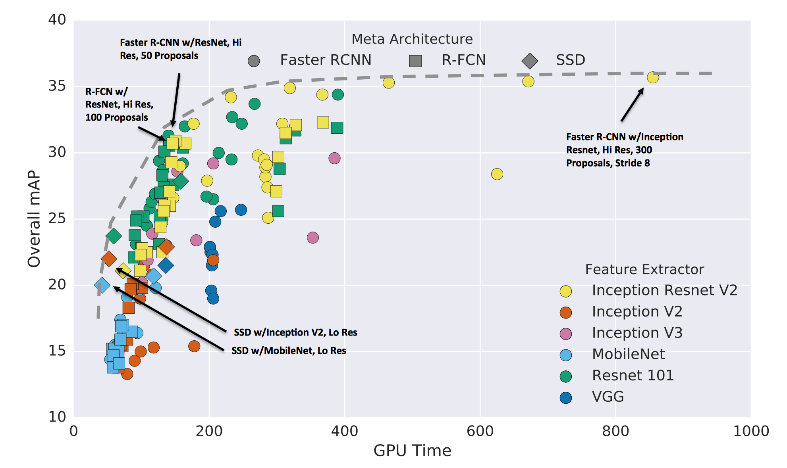

### Identifying Curb Ramps on Sidewalks through Google Street View images

Write about why detect curb ramps and assumptions
  
### 1. Extracting images from Google Street View

Pictures of intersections using Google Street View API. Lat/long extracted from [accessmap.io](https://accessmap.io)

### 2. Choosing the Model

#### Method for identifying curb ramps on images

There are different ways of identifying a  specific class on images, as illustrated in the picture below.

<p align="center"> </p>
<p align="center"><font size="1">Source: Facebook Research</font></p>

For this project I chose the object detection method. First, because since I'm training images with custom classes, it requires drawing simple bounding boxes around the ramps, instead of polygons as in segmentation. And I believe it would be a tricky task to use the classification method on a new category. 

Second, as a path to my quest, the Tensorflow Object Detection API - realeased by Google in 2017 - facilitates the task.

#### Tensorflow Object Detection API:

The Object Detection API has been trained on Microsoft COCO dataset (a dataset of about 300,000 images of 90 commonly found objects) with different trainable detection models. The API does the fine-tuning of a pre-trained object detection model with own data set with new classes, removing the last 90 neuron classification layer of the network and replacing it with a new layer that outputs 2 categories (yellow_curb_ramp, gray_curb_ramp). It also includes image augmentation, such as flipping and saturation.

#### Architecture

There's a speed/accuracy trade-off when choosing the object detection model, as despicted in the image below:

<p align="center"> </p>
<p align="center"><font size="1">Source: <a href="https://arxiv.org/pdf/1611.10012.pdf">Speed/accuracy trade-offs for modern convolutional object detectors</a></font></p>
  
The sweet spot is the “elbow” part of the mAP (Mean Average Precision) vs GPU time graph. Based on that, I chose to use [Faster R-CNN](https://arxiv.org/pdf/1506.01497.pdf) object detection model, with [RestNet](https://arxiv.org/abs/1512.03385) feature extractor, trained on [COCO](http://cocodataset.org) dataset.

### 3. Training the Model

#### Label the images

First, I filtered the streets' intersections images that were classified by [accessmap](https://accessmap.io) as having curb ramps. Afterwards, I draw retangles around yellow (with tactile warning) and grey curb ramps (without tactile warning) in 1000 images using [VOTT](https://github.com/Microsoft/VoTT/releases). I found this labelling tool more user-friendly than Rectlabel.

#### Install the API

```
git clone https://github.com/tensorflow/models.git
cd models/research/
protoc object_detection/protos/*.proto --python_out=.
export PYTHONPATH=$PYTHONPATH:`pwd`:`pwd`/slim
cd ..
cd ..
```

#### Convert labels to the TFRecord format

Tensorflow Object Detection API uses the TFRecord file format, so at the end we need to convert our dataset to this file format. I generated a tfrecord using a code adapted from this [raccoon detector](https://github.com/datitran/raccoon_dataset/blob/master/generate_tfrecord.py) .


#### Train the model

Once I decided the architecture, the first step for training, was to download the Faster-RCNN_RestNet model.

```
wget http://download.tensorflow.org/models/object_detection/faster_rcnn_resnet50_coco_2018_01_28.tar.gz
tar xvzf faster_rcnn_resnet50_coco_2018_01_28.tar.gz
```

Finally, I could train the model, using the command below on a new terminal:

 ```
 python3 models/research/object_detection/train.py \
 --logtostderr \
 --train_dir=${PATH_TO_TRAIN_DIR} \
 --pipeline_config_path=${PATH_TO_YOUR_PIPELINE_CONFIG}
 ```

I used tensorflow-gpu 1.5 on a Win10 machine with a NVIDIA GeForce GTX 970 4GB, following the installation steps described on the [Tensorflow website](https://www.tensorflow.org/install/install_windows). By using a GPU, the training was 10+ times faster than using tensorflow without GPU support on a MacBook.

Once training was complete it was time to test the model. The following command export the inference graph based on the best checkpoint:

```
python3 models/research/object_detection/export_inference_graph.py \
    --input_type image_tensor \
    --pipeline_config_path ${PIPELINE_CONFIG_PATH} \
    --trained_checkpoint_prefix ${TRAIN_PATH} \
    --output_directory object_detection_graph
```

### 4. Results!

I tested a few pictures on the model to check if it identifies the curb ramps.

### 5. Next Steps

* Learn how to get the precision and recall
* Learn how to improve image augmentation
* Train more images


