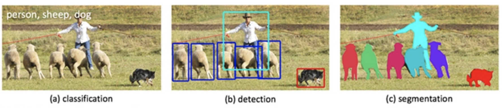

### Identifying curb ramps on sidewalks through Google Street View images

Write about why detect curb ramps and assumptions
  
### 1. The Data

#### Images extraction
Pictures of intersections using Google Street View API. Lat/long extracted from [accessmap.io](https://accessmap.io)

### 2. Choosing the Model

#### Method for identifying curb ramps on images

Image Classification x Object Detection x Object Segmentation.

add comparison image

 

Chose Object Detection
* Tensorflow Object Detection API facilitates this task
* Requires drawing bounding boxes for labeling objects in you own

#### Tensorflow Object Detection API:

Released in 2017.
Does the fine-tuning of a pre-trained object detection model using own data set with new classes, method called "transfer learning". It modifies the dense layers and the final softmax layer to output 2 categories (yellow_curb_ramp, gray_curb_ramp) instead of a 1000.

#### Architecture

There's a speed/accuracy trade-off when choosing the object detection model, as despicted in the image below:

 

  
The sweet spot is the “elbow” part of the mAP (Mean Average Precision) vs GPU time graph. Based on that, I chose to use [Faster R-CNN](https://arxiv.org/pdf/1506.01497.pdf) object detection model, with [RestNet](https://arxiv.org/abs/1512.03385) feature extractor, trained on [COCO](http://cocodataset.org) dataset.

### 3. Training the Model

#### GPU

#### Training dataset and labelling

#### Installing the API

#### Convert labels to the TFRecord format

#### Implement new model with TensorFlow

### 4. Results!

### 5. Next Steps

